# 🚀 VivaTech 2026 — Programme de Valorisation & Commercialisation
## 📅 Guide Stratégique pour Louis & Alban Hauseux (17–18 Juin 2026)

Ce guide a été conçu sur-mesure à partir de votre manuscrit de thèse et de vos présentations. Il structure vos deux jours à VivaTech pour maximiser les chances de succès de votre futur projet avec l'**Inria Startup Studio**, en ciblant les bons partenaires industriels (LiDAR, jumeaux numériques, CNDT, biotech) et en vous préparant aux conférences clés.

---

## 🎯 Objectifs de la Visite

1. **HGP-Clusterer 3D (Objectif N°1) :** Valider l'intérêt d'une API de clustering géométrique robuste (alternative à HDBSCAN) pour les acteurs du LiDAR 3D/4D et des jumeaux numériques (Dassault Systèmes, YellowScan, Wise Twin, CAD42).
2. **Détection de Fissures (Objectif N°2 - Signal/CNDT) :** Rencontrer des acteurs du contrôle non destructif et de la surveillance d'infrastructures (SSNDT) pour tester l'attrait commercial de votre squelettisation par graphes de Frangi.
3. **Assemblage d'Haplotypes (Objectif N°2 - BioTech) :** Échanger avec des entreprises de séquençage et de bio-informatique (Alithea Biotechnology) sur vos algorithmes de détection de communautés sur graphes signés (MCMC couplés).
4. **Parcours Inria Startup Studio :** Suivre le programme de la **Learning Expedition (LEX)** de l'Inria et réseauter avec des investisseurs DeepTech (Bpifrance, Elaia, Partech, etc.).

---

## 🗺️ Aperçu du Programme (Mercredi & Jeudi)

```mermaid
gantt
    title Programme VivaTech 2026
    dateFormat  HH:mm
    axisFormat %H:%M
    
    section Mercredi 17 Juin
    Arrivée & Accueil LEX Inria        :active, 14:00, 14:30
    Yann LeCun (VivaTech Theater)     : 14:30, 14:55
    Exploration & Sessions Stands (1) : 14:55, 17:30
    Débrief & Conférence Eklo Hotel   : 18:00, 19:30
    
    section Jeudi 18 Juin
    Café Stand Inria                  : 09:30, 09:45
    Conférence Quantum (Pasqal/IBM)   : 09:45, 10:45
    Conférence From Lab to Market     : 10:45, 11:30
    Conférence Free Models & Pricing  : 11:30, 12:00
    Déjeuner & Débrief Midi           : 12:00, 13:00
    Briefing & Planification CPPI     : 13:00, 14:00
    Conférence SaaS vs AI (Founders)  : 14:00, 14:45
    Pitchs Exposants Cibles (2)       : 14:45, 16:00
    Débrief Final LEX                 : 16:00, 16:30
```

---

## 🗓️ Mercredi 17 Juin 2026 : Validation de Marché & Prise de Contacts

> [!IMPORTANT]
> **Rendez-vous Inria LEX à 14h00** devant les grandes lettres **"VivaTech"** dans le hall principal pour le mot d'accueil des coordinateurs (Grégoire Maurice, Dylan Chomé, etc.).

### 🕒 Emploi du Temps
*   **14h00 - 14h30 :** Accueil officiel Inria Startup Studio et rencontre des autres doctorants.
*   **14h30 - 14h55 (Conférence Recommandée) :** *Beyond Language Models: Building AI that Understands the World* (**VivaTech Theater - Hall 7.3**).
    *   *Intervenant :* **Yann LeCun** (Meta, AMI Labs) en discussion avec Steven Levy (*Wired*).
    *   *Intérêt :* Entendre le pionnier du Deep Learning parler des représentations du monde et de la vision par ordinateur, hautement pertinent pour vos méthodes géométriques et vos modèles statistiques non paramétriques.
*   **14h55 - 17h30 (Temps Libre - Vos Cibles) :** Visite des exposants orientés **LiDAR/3D** et **Contrôle d'Infrastructures**.
    *   *Action :* Allez pitcher **Wise Twin**, **RESO3D** et cherchez le stand de **Dassault Systèmes** (demandez sa localisation exacte à l'accueil ou sur l'application mobile VivaTech).
*   **17h30 - 18h00 :** Déplacement vers l'hôtel Eklo.
*   **18h00 - 19h30 :** **Débriefing & Soirée Inria Startup Studio** (Hôtel Eklo Paris Porte de Versailles, *1 Rue du Moulin, 92170 Vanves*).
    *   *18h00 - 18h30 :* Débrief de l'après-midi.
    *   *18h30 - 19h00 :* Présentation du programme Inria Startup Studio.
    *   *19h00 - 19h30 :* Retours d'expérience de startups DeepTech, de VCs et de partenaires industriels. **(Moment idéal pour Alban pour discuter du montage financier/business de la future startup !)**

---

## 🗓️ Jeudi 18 Juin 2026 : Conférences DeepTech & Pitchs Exposants

> [!TIP]
> Ce deuxième jour est très rythmé, alternez entre les conférences du Founders Area / Purple Stage et vos visites de stands stratégiques.

### 🕒 Emploi du Temps
*   **09h30 - 09h45 :** Café réseau au **Stand Inria** (réparti sur les stands de Orange, La Poste, Caisse des Dépôts).
*   **09h45 - 10h45 (Conférence Recommandée) :** *Quantum Leap: When Will Quantum Computing Deliver Business Value?* (**Purple Stage - Hall 7.3**).
    *   *Intervenants :* Jerry Chow (IBM) & Loïc Henriet (Pasqal).
    *   *Intérêt :* Comprendre comment les grands algorithmes et les architectures de calcul intensif (comme Pasqal, spin-off académique français à succès) se structurent pour le marché B2B.
*   **10h10 - 10h30 (Optionnel - Réseau Inria) :** *Signature de l'accord Inria-DFKI* par **Bruno Sportisse** (CEO d'Inria) (**Startup Germany / German Park I**).
    *   *Intérêt :* Suivre la dynamique institutionnelle franco-allemande de l'Inria et réseauter avec la direction.
*   **10h45 - 11h30 (Conférence Majeure) :** *From Lab to Market* (**Founders Area - Hall 7.3**).
    *   *Intervenants :* Jacomo Corbo (PhysicsX) et Maximilien Levesque (Aqemia).
    *   *Intérêt :* **PhysicsX** fait du Deep Learning sur des maillages géométriques CAO et **Aqemia** est un spin-off d'Inria/ENS. C'est l'illustration parfaite de votre transition : vendre des algorithmes de pointe (complexes cellulaires, physiques) à l'industrie.
*   **11h30 - 12h00 :** *Selling When the Model is Free* (**Founders Area - Hall 7.3**).
    *   *Intérêt :* Indispensable pour votre modèle open-source / API hybride. Comment valoriser un algorithme mathématique lorsque le code de base est accessible ?
*   **12h00 - 13h00 :** Déjeuner libre (Food Court) et débriefing de la matinée.
*   **13h00 - 14h00 :** Session de connexion / Planification des visites avec le CPPI (Inria).
*   **14h00 - 14h45 (Conférence Recommandée) :** *Will AI Kill the SaaS Business Model by 2030?* (**Founders Area - Hall 7.3**).
    *   *Intérêt :* Réflexion cruciale sur le packaging de HGP-Clusterer (API SaaS vs. licence logicielle sur le edge pour les véhicules ou les serveurs locaux).
*   **14h45 - 16h00 (Pitchs Cibles) :** Visite des exposants restants (**YellowScan**, **CAD42**, **SSNDT**, **Alithea**).
*   **16h00 - 16h30 :** Débriefing final avec toutes les équipes Inria au Food Court.
*   **Après-midi (Optionnel - Réseau Inria) :** Discours de clôture de **Bruno Sportisse** pour l'atelier *"From Programming to Prompting: What Does Software Development Mean Today?"* (**Workshop Area B - Hall 7.3**).

---

## 🏢 Liste des Exposants Conseillés (Par ordre décroissant d'importance)

### 1. Dassault Systèmes
*   **Stand :** À localiser sur place via l'application mobile officielle VivaTech 2026 (souvent dans le pavillon de partenaires industriels ou de la Région Île-de-France).
*   **Objectif :** HGP-Clusterer 3D (Cible N°1).
*   **Informations clés :** Leader mondial des logiciels 3D et des jumeaux numériques (3DEXPERIENCE platform). Ils intègrent d'immenses nuages de points LiDAR dans leurs logiciels industriels et urbains pour la modélisation et la détection d'anomalies.
*   **Douleur client :** Le clustering de nuages de points denses et bruités est difficile avec (H)DBSCAN.
*   **Votre valeur :** HGP-Clusterer 3D isole parfaitement les géométries complexes sans entraînement et gère les bruits de percolation (ponts de bruit) grâce aux Delaunay d'ordre $K$.

### 2. YellowScan
*   **Stand :** **Hall 7, Niveau 7.2**, à côté de "Mission French Tech".
*   **Objectif :** HGP-Clusterer 3D (Objectif N°1).
*   **Informations clés :** Leader mondial des systèmes LiDAR pour drones. Ils vendent le matériel mais aussi la suite logicielle pour classifier les points (sol, végétation, lignes électriques, bâtiments).
*   **Douleur client :** Classifier automatiquement des objets complexes dans des scènes LiDAR bruyantes sans infrastructure d'apprentissage profond lourde.
*   **Votre valeur :** HGP-Clusterer 3D permet d'injecter des *a priori* géométriques et de volume faibles pour segmenter des instances 3D de manière robuste et sans entraînement.

### 3. Inria (Startup Studio)
*   **Stands :** Présent à travers les stands de ses partenaires : **Orange**, **La Poste**, **Caisse des Dépôts**, ainsi qu'au **German Park** et à l'**European Centre for AI Excellence**.
*   **Objectif :** Parcours Startup Studio (Objectif N°3).
*   **Informations clés :** L'institut où vous faites votre thèse. C'est l'opportunité de rencontrer l'équipe d'Inria Startup Studio en personne pour concrétiser votre candidature et structurer votre projet de valorisation DeepTech.

### 4. Bpifrance
*   **Stand :** **Stand 2F68** (Hall 7, Niveau 7.2, Business Plaza).
*   **Objectif :** Financement de la future startup (Objectif N°3).
*   **Informations clés :** Banque publique d'investissement, financeur numéro 1 de la DeepTech en France. Essentiel pour comprendre les subventions (Bourse French Tech, i-PhD) et les prêts DeepTech adaptés à un spin-off académique.

### 5. SSNDT (Smart Sensing and Non-Destructive Testing)
*   **Stand :** À localiser via l'application mobile officielle (co-exposant sur un pavillon d'ingénierie/recherche).
*   **Objectif :** Détection de Fissures (Objectif N°2 - Signal/Image).
*   **Informations clés :** Acteur de l'auscultation d'infrastructures et du contrôle non destructif.
*   **Douleur client :** Détecter avec précision des micro-fissures sur des matériaux réels (béton, métal) avec des images bruitées (optiques/thermiques) sans base de données d'apprentissage.
*   **Votre valeur :** Votre squelettisation par graphes de Frangi généralisés (Chapitre 12 de la thèse) fonctionne sans entraînement et fusionne efficacement les modalités visible/thermique.

### 6. Alithea Biotechnology GmbH
*   **Stand :** Pavillon swisstech / Suisse (à localiser via l'application mobile officielle).
*   **Objectif :** Assemblage d'Haplotypes (Objectif N°2 - BioTech).
*   **Informations clés :** Spécialiste du séquençage d'ARN haut débit (technologie BRB-seq).
*   **Douleur client :** Reconstruire des séquences et gérer l'assemblage de fragments génomiques complexes sous bruit de lecture.
*   **Votre valeur :** Votre cadre bayésien de détection de communautés sur graphes signés (MCMC couplés, Chapitre 11.4) qui bat les approches classiques dans les régimes bruités.

### 7. Wise Twin
*   **Stand :** **Stand 3H14** (Hall 7.3, pavillon IMT - Institut Mines-Télécom).
*   **Objectif :** HGP-Clusterer 3D (Jumeaux Numériques).
*   **Informations clés :** Développe des jumeaux numériques pour des infrastructures portuaires et industrielles. HGP-Clusterer 3D peut être intégré pour automatiser l'isolation d'anomalies de structure (comme votre projet Naval Group).

### 8. RESO3D
*   **Stand :** **Stand 3C14** (Hall 7, pavillon Région Sud).
*   **Objectif :** LiDAR 3D.
*   **Informations clés :** Spécialiste de la cartographie 3D de réseaux souterrains. Pertinent pour l'extraction de structures linéaires dans des nuages de points bruités.

### 9. CAD42
*   **Stand :** À localiser via l'application mobile officielle.
*   **Objectif :** LiDAR / Suivi 3D.
*   **Informations clés :** Suivi 3D en temps réel et sécurité sur chantiers. Synergies avec vos travaux sur le tracking 4D LiDAR (SemanticKITTI).

---

## 🎙️ Liste des Speakers & Conférences (Par ordre décroissant d'importance)

### 1. Jacomo Corbo (PhysicsX) & Maximilien Levesque (Aqemia)
*   **Conférence :** *From Lab to Market with PhysicsX, Aqemia, Qobly and Connected Circles*
*   **Date & Heure :** **Jeudi 18 Juin, 10h45 – 11h30**
*   **Lieu :** **Founders Area (Hall 7.3)**
*   **Pourquoi :** PhysicsX applique l'IA géométrique avancée aux simulations physiques et industrielles (CAO, maillages). Aqemia est un spin-off d'Inria/ENS à succès. Ils illustrent exactement comment passer d'algorithmes mathématiques complexes (complexes cellulaires, percolation) à une offre commerciale robuste.

### 2. Yann LeCun (Meta, AMI Labs)
*   **Conférence :** *Beyond Language Models: Building AI that Understands the World* (avec Steven Levy, *Wired*)
*   **Date & Heure :** **Mercredi 17 Juin, 14h30 – 14h55 CET**
*   **Lieu :** **VivaTech Theater (Hall 7.3)**
*   **Pourquoi :** La figure centrale de l'IA en France. Ses idées sur la compréhension géométrique et physique du monde par l'IA font écho à vos travaux sur les modèles non-paramétriques de clustering.

### 3. Bruno Sportisse (CEO d'Inria)
*   **Événement N°1 :** *Signing of the Franco-German Center on AI / DFKI-Inria Agreement*
    *   **Date & Heure :** **Jeudi 18 Juin, 10h10 – 10h30**
    *   **Lieu :** **Startup Germany / German Park I**
*   **Événement N°2 :** *Closing remarks: From Programming to Prompting*
    *   **Date & Heure :** **Jeudi 18 Juin, Après-midi**
    *   **Lieu :** **Workshop Area B (Hall 7.3)**
*   **Pourquoi :** C'est le dirigeant de votre institut de recherche, très investi dans l'Inria Startup Studio. Idéal pour du réseautage institutionnel.

### 4. Jerry Chow (IBM Quantum) & Loïc Henriet (Pasqal)
*   **Conférence :** *Quantum leap: when will quantum computing deliver business value?*
*   **Date & Heure :** **Jeudi 18 Juin, 09h45 – 10h45**
*   **Lieu :** **Purple Stage (Hall 7.3)**
*   **Pourquoi :** Pasqal est l'un des plus grands succès français de DeepTech issue de la recherche académique. Intéressant pour comprendre le cycle de vente de technologies de calcul intensif complexes.

---

## 🗣️ Fiches de Pitch Rapide (2 minutes)

### Pitch A : HGP-Clusterer (Pour Dassault, YellowScan, Wise Twin)
> *"Bonjour, je suis Louis Hauseux, chercheur à l'Inria et futur fondateur de startup, et voici mon frère et associé business, Alban Hauseux. Dans le traitement de nuages de points LiDAR 3D, tout le monde utilise (H)DBSCAN pour la segmentation d'instances. Mais (H)DBSCAN échoue dès qu'il y a du bruit ou des densités variables : il crée des ponts et fusionne des objets distincts.
> Mes travaux de thèse ont résolu ce problème en généralisant le Single-Linkage avec la géométrie des complexes de Čech et des Delaunay d'ordre K. Notre algorithme, **HGP-Clusterer**, est mathématiquement robuste au bruit et permet d'injecter des contraintes physiques (comme le volume estimé des objets) pour segmenter des scènes LiDAR urbaines ou industrielles sans aucun entraînement profond. Nous voulons proposer cela sous forme d'une API plug-and-play."*

### Pitch B : Détection de Fissures (Pour SSNDT)
> *"Bonjour, nous développons une technologie d'extraction de structures filaires pour le contrôle non destructif. Contrairement aux approches Deep Learning qui nécessitent des milliers d'images annotées et peinent sur les fissures très fines ou bruitées, notre approche repose sur des modèles géométriques explicites. En étendant le filtre de Frangi sous forme de graphe spatial et en utilisant des métriques de centralité et de percolation, nous extrayons des squelettes de fissures parfaits, même sur des acquisitions multimodales (visible + thermique). Le code est léger, explicite et fonctionne sans phase d'apprentissage."*

---

## 📂 Documents de Référence dans le Workspace

Pour retrouver les détails techniques durant vos trajets ou vos temps de pause :
*   Le manuscrit complet : [Manuscrit de thèse](file:///workspaces/VivaTech2026/Manuscrit_de_thèse_LouisHauseux_2026-06-15.pdf)
    *   *Détails HGP-Clusterer :* Chapitre 6 (p. 51) et Chapitre 9 (p. 93).
    *   *Détails Assemblage Haplotypes :* Chapitre 11, Section 11.4 (p. 141).
    *   *Détails Détection de Fissures :* Chapitre 12 (p. 145).
*   Les slides de présentation générale HGP : [Présentation HGP (B. Levy)](file:///workspaces/VivaTech2026/PresentationBrunoLevy_2026-06.pdf)
*   Les slides Graphes Signés & Haplotypes : [Présentation MathNet (Signed Graphs)](file:///workspaces/VivaTech2026/PresentationMathNet_2026-06-15_LouisHauseux_ABayesianFrameworkForCommunityDetectionOnSignedGraphs.pdf)
*   Les infos logistiques de la LEX : [Présentation LEX Inria Startup Studio](file:///workspaces/VivaTech2026/Présentation LEX VT26.pptx)
