# 🚀 VivaTech 2026 — Programme de Valorisation & Commercialisation
## 📅 Guide Stratégique pour Louis & Alban Hauseux (17–18 Juin 2026)

Ce guide a été conçu sur-mesure à partir de votre manuscrit de thèse et de vos présentations. Il structure vos deux jours à VivaTech pour maximiser les chances de succès de votre futur projet avec l'**Inria Startup Studio**, en ciblant les bons partenaires industriels (LiDAR, jumeaux numériques, CNDT, biotech, cyber) et en vous préparant aux conférences clés.

---

## 🎯 Objectifs de la Visite

1. **HGP-Clusterer 3D (Objectif N°1) :** Valider l'intérêt d'une API de clustering géométrique robuste (alternative à HDBSCAN) pour les acteurs du LiDAR 3D/4D et des jumeaux numériques (Dassault Systèmes, YellowScan, Wise Twin, CAD42).
2. **Applications Algorithmiques Secondaires (Objectif N°2) :** Valider l'attrait commercial de vos autres modèles théoriques :
    *   **Détection de Fissures (Signal/CNDT) :** Squelettisation par graphes de Frangi généralisés pour le contrôle d'infrastructures (SSNDT).
    *   **Assemblage d'Haplotypes (BioTech) :** Détection de communautés sur graphes signés (MCMC couplés) pour le séquençage génomique (Alithea Biotechnology).
    *   **Cybersécurité :** Application de vos modèles de graphes signés à la résolution 3-SAT (vérification/cryptanalyse) et à la détection d'intrusions réseau (Aikido Security, Cyberagentur).
3. **Parcours Inria Startup Studio (Objectif N°3) :** Suivre le programme de la **Learning Expedition (LEX)** de l'Inria et réseauter avec des investisseurs DeepTech (Bpifrance, Elaia, Partech, etc.) pour structurer la future startup.

---

## 🔒 Thème de Recherche Secondaire : Cybersécurité & Graphes

Vos travaux de thèse sur les graphes signés, la percolation et le clustering hiérarchique trouvent des applications directes dans le domaine de la cybersécurité. Voici comment vos modèles s'appliquent à ces données :

### A. Résolution du problème 3-SAT (Vérification formelle et Cryptanalyse)
*   **Données techniques :** Formules logiques CNF modélisant des propriétés de sécurité de logiciels (vérification de smart contracts, protocoles) ou des équations cryptographiques (collisions de hashs, clés privées).
*   **Modèles mathématiques :** Encodage de $3\text{-SAT}$ sous forme de graphes/hypergraphes signés. Introduction d'un nœud de référence $T$ (True) et construction de liens triangulaires (littéraux) et tétraédriques (avec $T$), où les signes encodent la logique de la clause. Résoudre la formule équivaut à minimiser l'énergie d'un modèle de spin (Spin Glass Ground State) via votre dynamique de Swendsen-Wang signée / triangulaire.
*   **Ce qu'on extrait :** Une affectation qui satisfait toutes les clauses, permettant de prouver la sécurité ou d'extraire un exploit (vulnérabilité).

### B. Détection d'Intrusions Réseau et Mouvements Latéraux
*   **Données techniques :** Graphes de flux réseaux (NetFlows) et graphes d'authentification (Active Directory) où les nœuds sont des utilisateurs/machines et les arêtes sont des connexions.
*   **Modèles mathématiques :** Stochastic Block Models (SBM) ou corrélation d'activités (attraction/répulsion). Utilisation de méthodes de percolation pour distinguer les bruits de fond du réseau (percolant) des attaques ciblées (isolées sous forme de petites communautés denses).
*   **Ce qu'on extrait :** Des sous-graphes d'anomalies représentant des botnets ou des mouvements latéraux.

### C. Classification de Malwares (Threat Intelligence)
*   **Données techniques :** Indicateurs de compromission (IOCs : signatures, appels API, clés de registre modifiées) partagés entre différents échantillons.
*   **Modèles mathématiques :** Correlation Clustering sur graphes signés (positif si IOCs partagés, négatif si comportements incompatibles). Votre algorithme MCMC probabiliste sur graphes signés permet de partitionner efficacement ces échantillons.
*   **Ce qu'on extrait :** Des familles de malwares (campagnes d'attaques coordonnées).

---

## 🗺️ Aperçu du Programme (Mercredi & Jeudi)

```mermaid
gantt
    title Programme VivaTech 2026
    dateFormat  HH:mm
    axisFormat %H:%M
    
    section Mercredi 17 Juin
    Arrivée & Accueil LEX Inria        :active, 14:00, 14:30
    Yann LeCun (VivaTech Theater)     : 14:30, 14:55
    Exploration & Sessions Stands (1) : 14:55, 17:30
    Débrief & Conférence Eklo Hotel   : 18:00, 19:30
    
    section Jeudi 18 Juin
    Café Stand Inria                  : 09:30, 09:45
    Conférence Quantum (Pasqal/IBM)   : 09:45, 10:45
    Conférence From Lab to Market     : 10:45, 11:30
    Conférence Free Models & Pricing  : 11:30, 12:00
    Déjeuner & Débrief Midi           : 12:00, 13:00
    Briefing & Planification CPPI     : 13:00, 14:00
    Conférence SaaS vs AI (Founders)  : 14:00, 14:45
    Conférence Cyber (Orange Cyber)   : 14:50, 15:35
    Pitchs Exposants Cibles (2)       : 14:45, 16:00
    Débrief Final LEX                 : 16:00, 16:30
```

---

## 🗓️ Mercredi 17 Juin 2026 : Validation de Marché & Prise de Contacts

> [!IMPORTANT]
> **Rendez-vous Inria LEX à 14h00** devant les grandes lettres **"VivaTech"** dans le hall principal pour le mot d'accueil des coordinateurs (Grégoire Maurice, Dylan Chomé, etc.).

### 🕒 Emploi du Temps
*   **14h00 - 14h30 :** Accueil officiel Inria Startup Studio et rencontre des autres doctorants.
*   **14h30 - 14h55 (Conférence Recommandée) :** *Beyond Language Models: Building AI that Understands the World* (**VivaTech Theater - Hall 7.3**).
    *   *Intervenant :* **Yann LeCun** (Meta, AMI Labs) en discussion avec Steven Levy (*Wired*).
    *   *Intérêt :* Entendre le pionnier du Deep Learning parler des représentations du monde et de la vision par ordinateur, hautement pertinent pour vos méthodes géométriques et vos modèles statistiques non paramétriques.
*   **14h55 - 17h30 (Temps Libre - Vos Cibles) :** Visite des exposants orientés **LiDAR/3D** et **Contrôle d'Infrastructures**.
    *   *Action :* Allez pitcher **Wise Twin**, **RESO3D** et cherchez le stand de **Dassault Systèmes** (demandez sa localisation exacte à l'accueil ou sur l'application mobile VivaTech).
*   **17h30 - 18h00 :** Déplacement vers l'hôtel Eklo.
*   **18h00 - 19h30 :** **Débriefing & Soirée Inria Startup Studio** (Hôtel Eklo Paris Porte de Versailles, *1 Rue du Moulin, 92170 Vanves*).
    *   *18h00 - 18h30 :* Débrief de l'après-midi.
    *   *18h30 - 19h00 :* Présentation du programme Inria Startup Studio.
    *   *19h00 - 19h30 :* Retours d'expérience de startups DeepTech, de VCs et de partenaires industriels. **(Moment idéal pour Alban pour discuter du montage financier/business de la future startup !)**

---

## 🗓️ Jeudi 18 Juin 2026 : Conférences DeepTech & Pitchs Exposants

> [!TIP]
> Ce deuxième jour est très rythmé, alternez entre les conférences du Founders Area / Purple Stage et vos visites de stands stratégiques.

### 🕒 Emploi du Temps
*   **09h30 - 09h45 :** Café réseau au **Stand Inria** (réparti sur les stands de Orange, La Poste, Caisse des Dépôts).
*   **09h45 - 10h45 (Conférence Recommandée) :** *Quantum Leap: When Will Quantum Computing Deliver Business Value?* (**Purple Stage - Hall 7.3**).
    *   *Intervenants :* Jerry Chow (IBM) & Loïc Henriet (Pasqal).
    *   *Intérêt :* Comprendre comment les grands algorithmes et les architectures de calcul intensif (comme Pasqal, spin-off académique français à succès) se structurent pour le marché B2B.
*   **10h10 - 10h30 (Optionnel - Réseau Inria) :** *Signature de l'accord Inria-DFKI* par **Bruno Sportisse** (CEO d'Inria) (**Startup Germany / German Park I**).
    *   *Intérêt :* Suivre la dynamique institutionnelle franco-allemande de l'Inria et réseauter avec la direction.
*   **10h45 - 11h30 (Conférence Majeure) :** *From Lab to Market* (**Founders Area - Hall 7.3**).
    *   *Intervenants :* Jacomo Corbo (PhysicsX) et Maximilien Levesque (Aqemia).
    *   *Intérêt :* **PhysicsX** fait du Deep Learning sur des maillages géométriques CAO et **Aqemia** est un spin-off d'Inria/ENS. C'est l'illustration parfaite de votre transition : vendre des algorithmes de pointe (complexes cellulaires, physiques) à l'industrie.
*   **11h30 - 12h00 :** *Selling When the Model is Free* (**Founders Area - Hall 7.3**).
    *   *Intérêt :* Indispensable pour votre modèle open-source / API hybride. Comment valoriser un algorithme mathématique lorsque le code de base est accessible ?
*   **12h00 - 13h00 :** Déjeuner libre (Food Court) et débriefing de la matinée.
*   **13h00 - 14h00 :** Session de connexion / Planification des visites avec le CPPI (Inria).
*   **14h00 - 14h45 (Conférence Recommandée) :** *Will AI Kill the SaaS Business Model by 2030?* (**Founders Area - Hall 7.3**).
    *   *Intérêt :* Réflexion cruciale sur le packaging de HGP-Clusterer (API SaaS vs. licence logicielle sur le edge pour les véhicules ou les serveurs locaux).
*   **14h50 - 15h35 (Conférence Cybersécurité) :** *AI vs. AI: The Race to Secure the Future* (**Purple Stage - Hall 7.3**). Table ronde avec **Hugues Foulon** (CEO de Orange Cyberdefense).
    *   *Intérêt :* Voir comment les modèles mathématiques prédictifs et les IAs autonomes luttent en temps réel contre les menaces.
*   **14h45 - 16h00 (Pitchs Cibles & Cyber) :** Visite des stands restants (**YellowScan**, **CAD42**, **SSNDT**, **Alithea**, et les exposants Cyber : **Aikido Security**, **Agentur für Innovation**).
*   **16h00 - 16h30 :** Débriefing final avec toutes les équipes Inria au Food Court.
*   **Après-midi (Optionnel - Réseau Inria) :** Discours de clôture de **Bruno Sportisse** pour l'atelier *"From Programming to Prompting: What Does Software Development Mean Today?"* (**Workshop Area B - Hall 7.3**).

---

## 🏢 Liste des Exposants Conseillés (Par ordre décroissant d'importance)

### 1. Dassault Systèmes
*   **Stand :** À localiser sur place via l'application mobile officielle VivaTech 2026 (ou aux bornes d'information).
*   **Objectif :** HGP-Clusterer 3D (Cible N°1).
*   **Informations clés :** Leader mondial des logiciels 3D et des jumeaux numériques (3DEXPERIENCE, CATIA).
*   **Recherche & Détails :** Leurs solutions industrielles ingèrent des nuages de points massifs issus de scans LiDAR terrestres ou aériens pour reconstruire des scènes industrielles réelles. Ils travaillent activement sur l'intégration de "surrogates physiques" pour simuler le comportement mécanique ou de flux directement sur ces géométries.
*   **Douleur client :** Le clustering de nuages de points denses et bruités est difficile avec (H)DBSCAN, qui crée des ponts de bruit et requiert un réglage manuel fastidieux des hyperparamètres.
*   **Votre valeur :** HGP-Clusterer 3D isole parfaitement les géométries complexes sans entraînement et gère les bruits de percolation (ponts de bruit) grâce aux Delaunay d'ordre $K$.

### 2. YellowScan
*   **Stand :** **Hall 7, Niveau 7.2**, à côté de "Mission French Tech".
*   **Objectif :** HGP-Clusterer 3D (Objectif N°1).
*   **Informations clés :** Leader mondial des systèmes LiDAR légers embarqués sur drones.
*   **Recherche & Détails :** YellowScan vend des capteurs matériels haut de gamme et des logiciels comme *CloudStation* pour traiter les nuages de points (calcul de trajectoire, calibration d'intensité, classification). Ils cherchent à automatiser la classification des sols, des bâtiments et de la végétation (foresterie, réseaux électriques).
*   **Douleur client :** Extraire et segmenter des objets géométriquement complexes (lignes de câbles, pylônes, arbres isolés) dans des données de vol très bruitées.
*   **Votre valeur :** HGP-Clusterer 3D permet d'injecter des *a priori* géométriques et de volume faibles pour segmenter des instances 3D de manière robuste et sans entraînement.

### 3. Inria (Startup Studio)
*   **Stands :** Présent à travers les stands de ses partenaires : **Orange**, **La Poste**, **Caisse des Dépôts**, ainsi qu'au **German Park** et à l'**European Centre for AI Excellence**.
*   **Objectif :** Parcours Startup Studio (Objectif N°3).
*   **Informations clés :** L'institut national de recherche en sciences et technologies du numérique.
*   **Recherche & Détails :** Le programme Inria Startup Studio offre un accompagnement complet de 12 à 18 mois pour transformer une recherche académique en startup viable (financement de salaires de co-fondateurs, mentoring, structuration de la propriété intellectuelle).
*   **Votre intérêt :** Rencontrer l'équipe (Grégoire Maurice, Dylan Chomé, etc.) pour caler votre dossier et discuter des transferts de brevets/logiciels de votre thèse.

### 4. Bpifrance
*   **Stand :** **Stand 2F68** (Hall 7, Niveau 7.2, Business Plaza).
*   **Objectif :** Financement de la future startup (Objectif N°3).
*   **Informations clés :** Banque publique d'investissement française.
*   **Recherche & Détails :** Bpifrance gère le *Plan Deeptech* national. Ils offrent des subventions et financements de démarrage non dilutifs comme la *Bourse French Tech*, le concours d'innovation *i-PhD* (destiné spécifiquement aux doctorants), et des prêts d'amorçage.
*   **Votre intérêt :** Alban doit comprendre la structure de ces financements (souvent conditionnés à l'association avec un profil commercial/business).

### 5. SSNDT (Smart Sensing and Non-Destructive Testing)
*   **Stand :** À localiser via l'application mobile officielle. *Note : Ils co-exposent généralement sur un pavillon thématique d'ingénierie, de contrôle industriel ou de recherche.*
*   **Objectif :** Détection de Fissures (Objectif N°2 - Signal/Image).
*   **Informations clés :** Acteur de l'auscultation d'infrastructures et du contrôle non destructif.
*   **Recherche & Détails :** SSNDT combine des capteurs intelligents et de la vision par ordinateur pour analyser l'état des structures (routes, béton armé, ouvrages d'art).
*   **Douleur client :** Les approches de Deep Learning classiques échouent sur les micro-fissures peu visibles ou bruitées et exigent des bases d'apprentissage géantes.
*   **Votre valeur :** Votre squelettisation par graphes de Frangi généralisés (Chapitre 12 de la thèse) fonctionne sans entraînement et fusionne efficacement les modalités visible/thermique.

### 6. Alithea Genomics (Alithea Biotechnology GmbH)
*   **Stand :** Pavillon swisstech / Suisse (à localiser via l'application mobile officielle). *Note : Alithea est une startup suisse basée à Lausanne.*
*   **Objectif :** Assemblage d'Haplotypes (Objectif N°2 - BioTech).
*   **Informations clés :** Spécialiste de la transcriptomique haut débit.
*   **Recherche & Détails :** Inventeurs de la technologie **BRB-seq** (Bulk RNA Barcoding and sequencing) qui permet de marquer (barcoder) individuellement les échantillons d'ARN dès la transcription inverse pour les séquencer en un seul tube (25x moins cher que les méthodes classiques).
*   **Douleur client :** Reconstruire et assembler des fragments génomiques/ARN bruités ou dégradés à partir de ces lectures massives multiplexées.
*   **Votre valeur :** Votre cadre bayésien de détection de communautés sur graphes signés (MCMC couplés, Chapitre 11.4) qui résout l'assemblage d'haplotypes dans des régimes très bruités.

### 7. Wise Twin
*   **Stand :** **Stand 3H14** (Hall 7.3, pavillon IMT - Institut Mines-Télécom). *Note : Ils y exposent sur le thème "transition industrielle+" le jeudi 18 juin.*
*   **Objectif :** HGP-Clusterer 3D (Jumeaux Numériques).
*   **Informations clés :** Startup de jumeaux numériques pour le domaine industriel et portuaire.
*   **Recherche & Détails :** Ils capturent des nuages de points 3D de sites industriels complets pour en faire des modèles géométriques interactifs et en analyser l'évolution temporelle.
*   **Douleur client :** Segmenter et classifier automatiquement chaque objet physique (grues, containers, tuyauteries) à partir des points bruts.
*   **Votre valeur :** HGP-Clusterer 3D permet d'automatiser cette segmentation géométrique sans données d'entraînement.

### 8. RESO3D
*   **Stand :** **Stand 3C14** (Hall 7, pavillon Région Sud). *Note : RESO3D fait partie de la délégation officielle de la Région Sud.*
*   **Objectif :** LiDAR 3D.
*   **Informations clés :** Spécialiste de la cartographie 3D de réseaux souterrains.
*   **Recherche & Détails :** Ils utilisent la photogrammétrie et le scan 3D pour modéliser les réseaux enterrés (canalisations, câblages électriques).
*   **Douleur client :** Extraire des lignes continues et des tubes géométriques à partir de nuages de points fragmentés et bruités par la poussière ou l'humidité des excavations.
*   **Votre valeur :** Votre approche d'extraction de réseaux par graphes de centralité et de percolation (Chapitre 12 de la thèse) s'applique directement à l'extraction de canalisations.

### 9. CAD42
*   **Stand :** À localiser via l'application mobile officielle (co-exposant possible sur un pavillon BTP/construction ou innovation industrielle).
*   **Objectif :** LiDAR / Suivi 3D.
*   **Informations clés :** Suivi 3D en temps réel et sécurité sur chantiers.
*   **Recherche & Détails :** CAD42 développe des systèmes embarqués sur grues et engins de chantier (crane anti-collision, détection de piétons) s'appuyant sur des capteurs spatiaux et du tracking temps réel.
*   **Votre intérêt :** Discuter de vos modèles de suivi temporel robuste d'instances 3D/4D (tracking d'instances sur nuages de points).

### 10. Agentur für Innovation in der Cybersicherheit GmbH (Cyberagentur)
*   **Stand :** À localiser dans l'espace Allemagne / German Park.
*   **Objectif :** Cybersécurité (Thème Secondaire - Financement).
*   **Informations clés :** Agence d'innovation allemande pour la cybersécurité.
*   **Recherche & Détails :** Agence publique qui finance des projets de recherche de rupture (DeepTech, IA, quantique, cryptographie post-quantique) avec un horizon à 10-15 ans. Ils ne font pas de recherche en interne mais allouent des budgets massifs à des consortia académiques/startups.
*   **Votre intérêt :** Présenter vos approches de modélisation de SAT-solving via Swendsen-Wang sur graphes signés.

### 11. Aikido Security
*   **Stand :** À localiser sur place via l'application mobile.
*   **Objectif :** Cybersécurité (Thème Secondaire - Vérification logicielle).
*   **Informations clés :** Solution unifiée de sécurité applicative (SAST/DAST/Cloud).
*   **Recherche & Détails :** Aikido intègre de nombreux scanners de vulnérabilités et déploie un moteur de tri (de-noising) pour éliminer les faux positifs et hiérarchiser les alertes en fonction du contexte de production.
*   **Votre intérêt :** Discuter des moteurs logiques de détection automatique de vulnérabilités logicielles (qui s'appuient sur des solveurs de contraintes SAT).

---

## 🎙️ Liste des Speakers & Conférences (Par ordre décroissant d'importance)

### 1. Jacomo Corbo (PhysicsX) & Maximilien Levesque (Aqemia)
*   **Conférence :** *From Lab to Market with PhysicsX, Aqemia, Qobly and Connected Circles*
*   **Date & Heure :** **Jeudi 18 Juin, 10h45 – 11h30** | **Lieu :** **Founders Area (Hall 7.3)**
*   **Recherche & Détails :**
    *   **Jacomo Corbo (PhysicsX) :** Ancien ingénieur en chef de stratégie F1 (Renault Team) et co-fondateur de QuantumBlack (McKinsey). Sa société *PhysicsX* développe des "surrogates IA" pour prédire des simulations de mécanique des fluides (CFD) ou d'éléments finis (FEA) directement à partir de fichiers CAO 3D en quelques secondes, éliminant les goulets d'étranglement de calcul numérique.
    *   **Maximilien Levesque (Aqemia) :** Ancien professeur de physique théorique (CNRS, ENS, Oxford, Cambridge). *Aqemia* utilise des algorithmes de physique statistique et quantique (résolution de l'équation d'Ornstein-Zernike moléculaire) pour générer ses propres données d'affinités chimiques et guider une IA générative dans la création de médicaments, sans exiger de bases de données d'apprentissage historiques.
    *   **Pourquoi :** C'est le modèle parfait d'application industrielle de mathématiques de haut niveau (complexes géométriques, physique statistique) vendues sous forme d'API B2B.

### 2. Yann LeCun (Meta, AMI Labs)
*   **Conférence :** *Beyond Language Models: Building AI that Understands the World* (avec Steven Levy, *Wired*)
*   **Date & Heure :** **Mercredi 17 Juin, 14h30 – 14h55 CET** | **Lieu :** **VivaTech Theater (Hall 7.3)**
*   **Recherche & Détails :** Chef scientifique de l'IA chez Meta, pionnier des réseaux de neurones convolutifs (CNN) et lauréat du prix Turing. Ses recherches actuelles portent sur le concept de "World Models" (modèles de monde) et l'apprentissage auto-supervisé pour doter les machines d'un sens commun physique et d'une perception spatio-temporelle rigoureuse.
*   **Pourquoi :** Son point de vue sur la vision par ordinateur et la compréhension géométrique du monde physique est essentiel pour vos travaux sur les modèles non-paramétriques et géométriques.

### 3. Bruno Sportisse (CEO d'Inria)
*   **Événement N°1 :** *Signing of the Franco-German Center on AI / DFKI-Inria Agreement*
    *   **Date & Heure :** **Jeudi 18 Juin, 10h10 – 10h30** | **Lieu :** **Startup Germany / German Park I**
*   **Événement N°2 :** *Closing remarks: From Programming to Prompting*
    *   **Date & Heure :** **Jeudi 18 Juin, Après-midi** | **Lieu :** **Workshop Area B (Hall 7.3)**
*   **Recherche & Détails :** Président-directeur général de l'Inria, ancien conseiller du Premier ministre sur l'innovation et le numérique, chercheur en mathématiques appliquées (calcul scientifique, environnement). Il pilote la stratégie de transfert technologique massif de l'Inria vers les startups (Inria Startup Studio).
*   **Pourquoi :** Idéal pour du réseautage institutionnel et pour comprendre la vision d'Inria sur l'entrepreneuriat des chercheurs.

### 4. Jerry Chow (IBM Quantum) & Loïc Henriet (Pasqal)
*   **Conférence :** *Quantum leap: when will quantum computing deliver business value?*
*   **Date & Heure :** **Jeudi 18 Juin, 09h45 – 10h45** | **Lieu :** **Purple Stage (Hall 7.3)**
*   **Recherche & Détails :**
    *   **Jerry Chow (IBM) :** Dirige les architectures de calcul intensif quantique chez IBM.
    *   **Loïc Henriet (Pasqal) :** CTO de Pasqal, spin-off académique français qui conçoit des processeurs quantiques à atomes neutres (rubidium piégé par pinces optiques). Pasqal est particulièrement connu pour résoudre des problèmes d'optimisation de graphes (comme le Maximum Independent Set) en les projetant directement sur les états physiques de ses atomes.
    *   **Pourquoi :** Comprendre les cycles de vente de technologies algorithmiques et de calcul de pointe complexes au niveau de grands groupes industriels.

### 5. Hugues Foulon (CEO d'Orange Cyberdefense)
*   **Conférence :** *AI vs. AI: The Race to Secure the Future*
*   **Date & Heure :** **Jeudi 18 Juin, 14h50 – 15h35** | **Lieu :** **Purple Stage (Hall 7.3)**
*   **Recherche & Détails :** Dirige Orange Cyberdefense, le premier prestataire européen de services de sécurité managés. Ses équipes surveillent les réseaux de milliers d'entreprises mondiales et intègrent l'IA pour la détection automatisée des menaces et des attaques.
*   **Pourquoi :** Roundtable clé pour comprendre les besoins actuels en termes d'IA prédictive et de détection automatique d'attaques réseau en temps réel.

---

## 🗣️ Fiches de Pitch Rapide (2 minutes)

### Pitch A : HGP-Clusterer (Pour Dassault, YellowScan, Wise Twin)
> *"Bonjour, je suis Louis Hauseux, chercheur à l'Inria et futur fondateur de startup, et voici mon frère et associé business, Alban Hauseux. Dans le traitement de nuages de points LiDAR 3D, tout le monde utilise (H)DBSCAN pour la segmentation d'instances. Mais (H)DBSCAN échoue dès qu'il y a du bruit ou des densités variables : il crée des ponts et fusionne des objets distincts.
> Mes travaux de thèse ont résolu ce problème en généralisant le Single-Linkage avec la géométrie des complexes de Čech et des Delaunay d'ordre K. Notre algorithme, **HGP-Clusterer**, est mathématiquement robuste au bruit et permet d'injecter des contraintes physiques (comme le volume estimé des objets) pour segmenter des scènes LiDAR urbaines ou industrielles sans aucun entraînement profond. Nous voulons proposer cela sous forme d'une API plug-and-play."*

### Pitch B : Détection de Fissures (Pour SSNDT)
> *"Bonjour, nous développons une technologie d'extraction de structures filaires pour le contrôle non destructif. Contrairement aux approches Deep Learning qui nécessitent des milliers d'images annotées et peinent sur les fissures très fines ou bruitées, notre approche repose sur des modèles géométriques explicites. En étendant le filtre de Frangi sous forme de graphe spatial et en utilisant des métriques de centralité et de percolation, nous extrayons des squelettes de fissures parfaits, même sur des acquisitions multimodales (visible + thermique). Le code est léger, explicite et fonctionne sans phase d'apprentissage."*

### Pitch C : Cybersécurité / Modèles de Graphes (Pour Cyberagentur, Aikido)
> *"Bonjour, je suis Louis Hauseux, chercheur à l'Inria, et voici Alban, mon associé business. Nos travaux portent sur l'application de la théorie des graphes et des modèles de spin statistiques à la structuration de données bruitées. En cybersécurité, nous appliquons nos modèles de graphes signés (MCMC couplés et percolation) à la résolution ultra-rapide de formules 3-SAT pour la vérification de code et la cryptanalyse, mais aussi à la détection probabiliste de botnets et de mouvements latéraux dans les graphes de flux réseau. Nous cherchons à valider des cas d'usage industriels pour ces modèles mathématiques."*

---

## 📂 Documents de Référence dans le Workspace

Pour retrouver les détails techniques durant vos trajets ou vos temps de pause :
*   Le manuscrit complet : [Manuscrit de thèse](file:///workspaces/VivaTech2026/Manuscrit_de_thèse_LouisHauseux_2026-06-15.pdf)
    *   *Détails HGP-Clusterer :* Chapitre 6 (p. 51) et Chapitre 9 (p. 93).
    *   *Détails Assemblage Haplotypes :* Chapitre 11, Section 11.4 (p. 141).
    *   *Détails Détection de Fissures :* Chapitre 12 (p. 145).
*   Les slides de présentation générale HGP : [Présentation HGP (B. Levy)](file:///workspaces/VivaTech2026/PresentationBrunoLevy_2026-06.pdf)
*   Les slides Graphes Signés & Haplotypes : [Présentation MathNet (Signed Graphs)](file:///workspaces/VivaTech2026/PresentationMathNet_2026-06-15_LouisHauseux_ABayesianFrameworkForCommunityDetectionOnSignedGraphs.pdf)
*   Les infos logistiques de la LEX : [Présentation LEX Inria Startup Studio](file:///workspaces/VivaTech2026/Présentation LEX VT26.pptx)
