# 🚀 VivaTech 2026 — Programme de Valorisation & Commercialisation
## 📅 Guide Stratégique pour Louis & son Frère (17–18 Juin 2026)

Ce guide a été conçu sur-mesure à partir de votre manuscrit de thèse et de vos présentations. Il structure vos deux jours à VivaTech pour maximiser les chances de succès de votre futur projet avec l'**Inria Startup Studio**, en ciblant les bons partenaires industriels (LiDAR, jumeaux numériques, CNDT, biotech) et en vous préparant aux conférences clés.

---

## 🎯 Objectifs de la Visite

1. **HGP-Clusterer 3D (Objectif N°1) :** Valider l'intérêt d'une API de clustering géométrique robuste (alternative à HDBSCAN) pour les acteurs du LiDAR 3D/4D et des jumeaux numériques (Dassault Systèmes, YellowScan, Wise Twin, CAD42).
2. **Détection de Fissures (Objectif N°2 - Signal/CNDT) :** Rencontrer des acteurs du contrôle non destructif et de la surveillance d'infrastructures (SSNDT) pour tester l'attrait commercial de votre squelettisation par graphes de Frangi.
3. **Assemblage d'Haplotypes (Objectif N°2 - BioTech) :** Échanger avec des entreprises de séquençage et de bio-informatique (Alithea Biotechnology) sur vos algorithmes de détection de communautés sur graphes signés (MCMC couplés).
4. **Parcours Inria Startup Studio :** Suivre le programme de la **Learning Expedition (LEX)** de l'Inria et réseauter avec des investisseurs DeepTech (Bpifrance, Elaia, Partech, etc.).

---

## 🗺️ Aperçu du Programme (Mercredi & Jeudi)

```mermaid
gantt
    title Programme VivaTech 2026
    dateFormat  HH:mm
    axisFormat %H:%M
    
    section Mercredi 17 Juin
    Arrivée & Accueil LEX Inria        :active, 14:00, 14:30
    Exploration & Sessions Stands (1) : 14:30, 17:30
    Débrief & Conférence Eklo Hotel   : 18:00, 19:30
    
    section Jeudi 18 Juin
    Café Stand Inria                  : 09:30, 09:45
    Conférences Mkt / DeepTech / Quantum : 09:45, 12:00
    Déjeuner & Débrief Midi           : 12:00, 13:00
    Briefing & Planification CPPI     : 13:00, 14:00
    Conférence SaaS vs AI (Founders)  : 14:00, 14:45
    Pitchs Exposants Cibles (2)       : 14:45, 16:00
    Débrief Final LEX                 : 16:00, 16:30
```

---

## 🗓️ Mercredi 17 Juin 2026 : Validation de Marché & Prise de Contacts

> [!IMPORTANT]
> **Rendez-vous Inria LEX à 14h00** devant les grandes lettres **"VivaTech"** dans le hall principal pour le mot d'accueil des coordinateurs (Grégoire Maurice, Dylan Chomé, etc.).

### 🕒 Emploi du Temps
*   **14h00 - 14h30 :** Accueil officiel Inria Startup Studio et rencontre des autres doctorants.
*   **14h30 - 17h30 (Temps Libre - Vos Cibles) :** Visite des exposants orientés **LiDAR/3D** et **Contrôle d'Infrastructures**.
    *   *Action :* Allez pitcher **Wise Twin**, **RESO3D** et cherchez le stand de **Dassault Systèmes** (demandez sa localisation exacte à l'accueil ou sur l'application mobile VivaTech).
*   **17h30 - 18h00 :** Déplacement vers l'hôtel Eklo.
*   **18h00 - 19h30 :** **Débriefing & Soirée Inria Startup Studio** (Hôtel Eklo Paris Porte de Versailles, *1 Rue du Moulin, 92170 Vanves*).
    *   *18h00 - 18h30 :* Débrief de l'après-midi.
    *   *18h30 - 19h00 :* Présentation du programme Inria Startup Studio.
    *   *19h00 - 19h30 :* Retours d'expérience de startups DeepTech, de VCs et de partenaires industriels. **(Moment idéal pour votre frère pour discuter du montage financier/business de la future startup !)**

---

## 🗓️ Jeudi 18 Juin 2026 : Conférences DeepTech & Pitchs Exposants

> [!TIP]
> Ce deuxième jour est très rythmé, alternez entre les conférences du Founders Area / Purple Stage et vos visites de stands stratégiques.

### 🕒 Emploi du Temps
*   **09h30 - 09h45 :** Café réseau au **Stand Inria**.
*   **09h45 - 10h45 (Conférence Recommandée) :** *Quantum Leap: When Will Quantum Computing Deliver Business Value?* (**Purple Stage**).
    *   *Intervenants :* Jerry Chow (IBM) & Loïc Henriet (CTO de Pasqal).
    *   *Intérêt :* Comprendre comment les grands algorithmes et les architectures de calcul intensif se structurent pour le marché B2B.
*   **10h45 - 11h30 (Conférence Majeure) :** *From Lab to Market* (**Founders Area**).
    *   *Intervenants :* Jacomo Corbo (PhysicsX) et Maximilien Levesque (Aqemia).
    *   *Intérêt :* **PhysicsX** fait du Deep Learning sur des maillages géométriques CAO et **Aqemia** est un spin-off d'Inria/ENS. C'est l'illustration parfaite de votre transition : vendre des algorithmes de pointe (complexes cellulaires, physiques) à l'industrie.
*   **11h30 - 12h00 :** *Selling When the Model is Free* (**Founders Area**).
    *   *Intérêt :* Indispensable pour votre modèle open-source / API hybride. Comment valoriser un algorithme mathématique lorsque le code de base est accessible ?
*   **12h00 - 13h00 :** Déjeuner libre (Food Court) et débriefing de la matinée.
*   **13h00 - 14h00 :** Session de connexion / Planification des visites avec le CPPI (Inria).
*   **14h00 - 14h45 (Conférence Recommandée) :** *Will AI Kill the SaaS Business Model by 2030?* (**Founders Area**).
    *   *Intérêt :* Réflexion cruciale sur le packaging de HGP-Clusterer (API SaaS vs. licence logicielle sur le edge pour les véhicules ou les serveurs locaux).
*   **14h45 - 16h00 (Pitchs Cibles) :** Visite des exposants restants (**YellowScan**, **CAD42**, **SSNDT**, **Alithea**).
*   **16h00 - 16h30 :** Débriefing final avec toutes les équipes Inria au Food Court.

---

## 🏢 Les Exposants Stratégiques à Rencontrer

### 1. Pour HGP-Clusterer 3D (LiDAR / 3D / Jumeaux Numériques)

*   **Dassault Systèmes (Stand à localiser via l'application) :**
    *   *Pourquoi :* Leader mondial de la CAO 3D et des jumeaux numériques. C'est votre **cible N°1**. Ils intègrent des nuages de points LiDAR dans leurs logiciels (CATIA, 3DEXPERIENCE) pour reconstituer des usines, des villes ou des navires.
    *   *Leur douleur :* Le clustering spatial de nuages de points denses et bruités est difficile avec (H)DBSCAN.
    *   *Votre solution :* HGP-Clusterer 3D isole parfaitement les géométries complexes sans entraînement et gère les bruits de percolation (ponts de bruit) grâce aux Delaunay d'ordre $K$.
*   **YellowScan (Stand 2711) :**
    *   *Pourquoi :* Leader mondial des systèmes LiDAR pour drones. Ils vendent le matériel mais aussi la suite logicielle pour classifier les points (sol, végétation, bâtiments).
    *   *Leur douleur :* Classifier automatiquement des objets complexes (arbres, lignes électriques, fissures sur pylônes) dans des scènes LiDAR bruyantes.
    *   *Votre solution :* HGP-Clusterer 3D permet d'injecter des *a priori* de volume et géométriques faibles pour faire de la segmentation d'instances 3D robuste sans base de données d'apprentissage.
*   **Wise Twin (Stands 2676-2677) :**
    *   *Pourquoi :* Startup qui développe des jumeaux numériques pour des infrastructures industrielles et portuaires complexes.
    *   *Leur douleur :* Traiter de grands volumes de scans 3D pour détecter des anomalies ou segmenter des structures.
*   **RESO3D (Stand 2099) :**
    *   *Pourquoi :* Spécialistes de la cartographie 3D de réseaux (notamment souterrains).
    *   *Leur douleur :* Extraire des structures linéaires (tuyaux, câbles) à partir de nuages de points bruités.
*   **CAD42 (Stand 462) :**
    *   *Pourquoi :* Suivi 3D en temps réel et gestion de la sécurité sur les chantiers de construction. Intéressant pour votre approche de tracking 4D.

### 2. Pour la Détection de Fissures (Signal / Image / CNDT)

*   **SSNDT (Stand 2329) :**
    *   *Pourquoi :* Acteur spécialisé en "Smart Sensing & Non-Destructive Testing" (Contrôle Non Destructif - CNDT).
    *   *Leur douleur :* Détecter avec précision des fissures microscopiques sur des pièces métalliques ou du béton avec des images optiques ou thermiques bruitées, sans avoir des millions d'images pour entraîner un réseau de neurones.
    *   *Votre solution :* Votre algorithme de squelettisation par graphes de Frangi généralisés (Chapitre 12 de votre thèse) fusionne le visible et le thermique (multimodal) et utilise des métriques de centralité sur graphe, garantissant une détection sans base d'apprentissage.

### 3. Pour l'Assemblage d'Haplotypes (Bio-informatique / Graphes Signés)

*   **Alithea Biotechnology GmbH (Stand 156) :**
    *   *Pourquoi :* Leader du séquençage ARN haut débit. Bien qu'ils fassent de l'ARN, ils gèrent des problématiques complexes de reconstruction de séquences et de bio-informatique.
    *   *Leur douleur :* L'assemblage de génomes ou de fragments d'acides nucléiques complexes en présence d'erreurs de lecture.
    *   *Votre solution :* Votre modèle bayésien pour graphes signés (Swendsen-Wang signé et dynamique triangulaire) qui résout l'assemblage d'haplotypes (Sankararaman-Baccelli) dans des régimes très bruités en exploitant la percolation.

---

## 🗣️ Fiches de Pitch Rapide (2 minutes)

### Pitch A : HGP-Clusterer (Pour Dassault, YellowScan, Wise Twin)
> *"Bonjour, je suis Louis Hauseux, chercheur à l'Inria et futur fondateur de startup, et voici mon frère et associé business. Dans le traitement de nuages de points LiDAR 3D, tout le monde utilise (H)DBSCAN pour la segmentation d'instances. Mais (H)DBSCAN échoue dès qu'il y a du bruit ou des densités variables : il crée des ponts et fusionne des objets distincts.
> Mes travaux de thèse ont résolu ce problème en généralisant le Single-Linkage avec la géométrie des complexes de Čech et des Delaunay d'ordre K. Notre algorithme, **HGP-Clusterer**, est mathématiquement robuste au bruit et permet d'injecter des contraintes physiques (comme le volume estimé des objets) pour segmenter des scènes LiDAR urbaines ou industrielles sans aucun entraînement profond. Nous voulons proposer cela sous forme d'une API plug-and-play."*

### Pitch B : Détection de Fissures (Pour SSNDT)
> *"Bonjour, nous développons une technologie d'extraction de structures filaires pour le contrôle non destructif. Contrairement aux approches Deep Learning qui nécessitent des milliers d'images annotées et peinent sur les fissures très fines ou bruitées, notre approche repose sur des modèles géométriques explicites. En étendant le filtre de Frangi sous forme de graphe spatial et en utilisant des métriques de centralité et de percolation, nous extrayons des squelettes de fissures parfaits, même sur des acquisitions multimodales (visible + thermique). Le code est léger, explicite et fonctionne sans phase d'apprentissage."*

---

## 📂 Documents de Référence dans le Workspace

Pour retrouver les détails techniques durant vos trajets ou vos temps de pause :
*   Le manuscrit complet : [Manuscrit de thèse](file:///workspaces/VivaTech2026/Manuscrit_de_thèse_LouisHauseux_2026-06-15.pdf)
    *   *Détails HGP-Clusterer :* Chapitre 6 (p. 51) et Chapitre 9 (p. 93).
    *   *Détails Assemblage Haplotypes :* Chapitre 11, Section 11.4 (p. 141).
    *   *Détails Détection de Fissures :* Chapitre 12 (p. 145).
*   Les slides de présentation générale HGP : [Présentation HGP (B. Levy)](file:///workspaces/VivaTech2026/PresentationBrunoLevy_2026-06.pdf)
*   Les slides Graphes Signés & Haplotypes : [Présentation MathNet (Signed Graphs)](file:///workspaces/VivaTech2026/PresentationMathNet_2026-06-15_LouisHauseux_ABayesianFrameworkForCommunityDetectionOnSignedGraphs.pdf)
*   Les infos logistiques de la LEX : [Présentation LEX Inria Startup Studio](file:///workspaces/VivaTech2026/Présentation LEX VT26.pptx)
