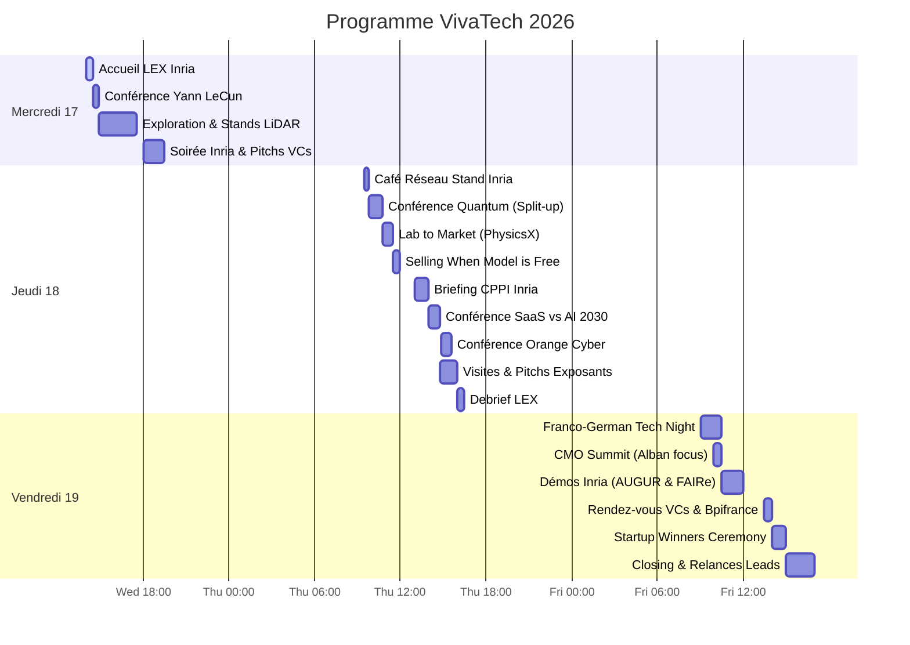

# 🚀 VivaTech 2026 — Guide de Valorisation & Commercialisation
## 📅 Guide Stratégique pour Louis & Alban Hauseux (17–19 Juin 2026)

Ce guide a été conçu sur-mesure à partir de votre manuscrit de thèse ([Manuscrit de thèse](file:///workspaces/VivaTech2026/Manuscrit_de_thèse_LouisHauseux_2026-06-15.pdf)), de vos présentations ([Présentation HGP](file:///workspaces/VivaTech2026/PresentationBrunoLevy_2026-06.pdf) & [Présentation MathNet](file:///workspaces/VivaTech2026/PresentationMathNet_2026-06-15_LouisHauseux_ABayesianFrameworkForCommunityDetectionOnSignedGraphs.pdf)), des contraintes logistiques de la Learning Expedition d'Inria ([Présentation LEX Inria](file:///workspaces/VivaTech2026/Présentation%20LEX%20VT26.pptx)), ainsi que des opportunités d'affaires de la journée du vendredi 19 juin.

---

## 🎯 Profils & Objectifs du Binôme

*   **Louis Hauseux** : Recherche & Technologie (Clustering 3D, Delaunay d'ordre $K$, complexes de Čech, graphes signés, dynamique de percolation).
*   **Alban Hauseux** : Modèle d'affaires, Finance, Pricing, Financement (BFTD, i-PhD) et relations avec Bpifrance & investisseurs.

### 🏆 4 Axes Applicatifs à Valider
1.  **HGP-Clusterer 3D (Cœur du projet)** : Remplacer (H)DBSCAN dans les flux LiDAR/3D et jumeaux numériques sans phase d'entraînement (anti-ponts de bruit).
2.  **Squelettisation de Fissures (CNDT)** : Auscultation automatique de structures via des graphes de Frangi sans biais d'apprentissage profond.
3.  **Graphes Signés & Génomique (BioTech)** : Résoudre l'assemblage d'haplotypes (DNA/ARN) sous fort bruit par des méthodes MCMC couplées.
4.  **Cybersécurité (SAT & Intrusion)** : Solveurs 3-SAT (Swendsen-Wang) pour la cryptanalyse et détection d'intrusions zero-shot sur flux réseau.

---

## 🔒 Thème de Recherche Secondaire : Cybersécurité & Graphes

Vos travaux de thèse sur les graphes signés, la percolation et le clustering hiérarchique trouvent des applications directes dans le domaine de la cybersécurité. Voici comment vos modèles s'appliquent à ces données :

### A. Résolution du problème 3-SAT (Vérification formelle et Cryptanalyse)
*   **Données techniques :** Formules logiques CNF (Conjunctive Normal Form) modélisant des propriétés de sécurité de logiciels (vérification de smart contracts, protocoles cryptographiques) ou des équations logiques décrivant des primitives cryptographiques (recherche de collisions de hashs, cryptanalyse algébrique de clés de chiffrement comme AES).
*   **Modèles mathématiques :** Modélisation de $3\text{-SAT}$ sous forme de graphes et d'hypergraphes signés. Introduction d'un nœud de référence $T$ (True), construction de liens triangulaires (littéraux) et tétraédriques (avec $T$). Vos travaux démontrent que la **dynamique triangulaire** (Swendsen-Wang généralisée à l'ordre supérieur) génère une **percolation de triangles corrélés** dont le seuil critique est strictement meilleur que la percolation d'arêtes classique.
*   **Application Cyber :** Cela permet aux échantillonneurs MCMC de traverser et d'échapper rapidement aux minima locaux (frustration logique) inhérents aux équations de cryptanalyse, là où les solveurs classiques (SAT solvers stochastiques) restent bloqués.
*   **Ce qu'on extrait :** Une affectation satisfaisant toutes les clauses, correspondant à une clé cryptographique découverte ou à un chemin d'exploit logique.

### B. Détection d'Intrusions Réseau (Zero-Shot Network Anomaly Detection)
*   **Données techniques :** Graphes de flux réseaux à haute dimension (NetFlows : IP sources, IP cibles, ports, protocoles, paquets) et journaux d'accès Active Directory.
*   **Modèles mathématiques :** Utilisation de **HGP-Clusterer** (complexes de Čech et triangulation de Delaunay d'ordre $K$). DBSCAN et HDBSCAN souffrent de l'effet de chaînage ("noise-bridge") où quelques paquets de bruit connectent anormalement une intrusion à faible densité avec le trafic de fond à haute densité, masquant l'attaque. HGP-Clusterer résout cela via la percolation sur complexes cellulaires de Čech, isolant rigoureusement les ponts de bruit.
*   **Application Cyber :** Détection d'anomalies (exfiltration de données, mouvements latéraux) sans aucune base de données d'apprentissage historique, en s'appuyant uniquement sur des *a priori* géométriques faibles de volume et de densité.
*   **Ce qu'on extrait :** Des sous-graphes d'anomalies compacts représentant des botnets ou des identités compromises.

### C. Classification de Malwares (Threat Intelligence & Attribution)
*   **Données techniques :** Indicateurs de compromission (IOCs) partagés entre fichiers de virus (IPs de serveurs C2, clés de registre, signatures de fichiers, sous-routines de code).
*   **Modèles mathématiques :** Modélisation sous forme de **Graphes Signés** où une arête positive (attraction) indique le partage d'indicateurs uniques (même auteur supposé) et une arête négative (répulsion) indique des conflits techniques incompatibles (compilateur différent, cibles géographiques opposées).
*   **Application Cyber :** Application de votre modèle bayésien et de l'échantillonnage de Gibbs (Swendsen-Wang signé) pour partitionner de manière robuste et probabiliste les échantillons en familles d'attaques, même face à des techniques de déception (faux indicateurs insérés par les attaquants).
*   **Ce qu'on extrait :** Des regroupements de malwares (campagnes d'attaques coordonnées) et des attributions de groupes APT.

### D. Tracé de Tunnels de Communication Botnet (C2 Command Channels)
*   **Données techniques :** Graphes de routage internet ou topologies logiques de communication.
*   **Modèles mathématiques :** Utilisation de votre squelettisation par **graphe de Frangi généralisé** et métriques de centralité spatiale (Chapitre 12 de la thèse).
*   **Application Cyber :** Les canaux de communication C2 (Command & Control) forment des structures linéaires arborescentes au milieu du bruit de fond du trafic internet global. En appliquant votre filtre géométrique de Frangi adapté à la dimensionalité du réseau et en mesurant la centralité pondérée des branches, on extrait la structure "osseuse" du réseau de botnets.
*   **Ce qu'on extrait :** Les adresses IPs ou nœuds pivots abritant les serveurs de commande centraux à neutraliser.

---

## 🗺️ Aperçu du Programme (Gantt)

---

## 🗓️ Agenda Chronologique & Opérationnel

### Mercredi 17 Juin 2026 : Immersion & Cadrage 3D/LiDAR
> [!IMPORTANT]
> **Rendez-vous à 14h00** devant les lettres **"VivaTech"** (Hall principal) pour le mot d'accueil Inria LEX (Dylan Chomé, Grégoire Maurice).

*   **14h00 - 14h30 : Accueil officiel Inria LEX**
    *   Rencontre des autres porteurs de projets DeepTech et coordinateurs d'Inria Startup Studio.
*   **14h30 - 14h55 (Conférence Recommandée) : *Beyond Language Models: Building AI that Understands the World*** (VivaTech Theater - Hall 7.3)
    *   *Intervenant* : **Yann LeCun** (Meta / AMI Labs) avec Steven Levy.
    *   *Intérêt* : Comprendre sa vision des *World Models* et de la vision auto-supervisée, en adéquation avec vos a priori géométriques/physiques.
*   **14h55 - 17h30 (Parcours Cible 1 : LiDAR, 3D & Jumeaux Numériques)**
    *   *Action* : Démarcher les acteurs majeurs du LiDAR et de la 3D pour présenter HGP-Clusterer.
    *   *Stands prioritaires* :
        *   **Exwayz** (Stand 949) : Le *match* idéal. Spécialistes du SLAM 3D pour LiDAR.
        *   **YellowScan** (Hall 7.2, près de Mission French Tech) : Systèmes LiDAR embarqués sur drones.
        *   **ALTAMETRIS** (Stand 177) : Filiale de la SNCF d'inspection industrielle par drones et LiDAR (jumeaux numériques).
        *   **Wise Twin** (Stand 3H14) : Jumeaux numériques portuaires/industriels.
        *   *Repérage* : Localiser le pavillon de **Dassault Systèmes** dans le Hall 7 pour planifier une visite.
*   **18h00 - 19h30 : Débriefing & Soirée Inria Startup Studio** (Hôtel Eklo, *1 Rue du Moulin, 92170 Vanves*)
    *   *18h00 - 18h30* : Débriefing de l'après-midi.
    *   *18h30 - 19h00* : Présentation du programme Inria Startup Studio (financement, mentorat).
    *   *19h00 - 19h30* : REX de startups DeepTech et de VCs partenaires.
    *   *💡 Opportunité pour Alban* : Échanger avec les VCs et les chargés d'affaires d'Inria sur le montage du futur dossier financier.

---

### Jeudi 18 Juin 2026 : DeepTech, Algorithmes & Pitchs Complexes
> [!TIP]
> **Stratégie de Division (Split-up) à 10h10** : Louis assiste à la conférence Quantum (Pasqal) sur la Purple Stage pendant qu'Alban se rend au German Park pour assister à la signature officielle Inria-DFKI de Bruno Sportisse et initier le réseau institutionnel.

*   **09h30 - 09h45 : Café Stand Inria** (Hall 7.2 – Stand 2HG2).
*   **09h45 - 10h45 (Conférence Quantum B2B) : *Quantum Leap: When Will Quantum Computing Deliver Business Value?*** (Purple Stage - Hall 7.3)
    *   *Intervenants* : Jerry Chow (IBM Quantum) & Loïc Henriet (Pasqal).
    *   *Intérêt* : Analyser le modèle de transfert technologique d'une DeepTech quantique issue du milieu académique (Pasqal) vers le B2B.
*   *📌 [Option Alban] 10h10 - 10h30* : **Signature accord Inria-DFKI** par Bruno Sportisse (CEO Inria) (German Park / Espace Allemagne).
*   **10h45 - 11h30 (Conférence Clé) : *From Lab to Market*** (Founders Area - Hall 7.3)
    *   *Intervenants* : Jacomo Corbo (PhysicsX) & Maximilien Levesque (Aqemia).
    *   *Intérêt* : PhysicsX utilise le Deep Learning géométrique sur meshes/CAO pour accélérer les simulations, et Aqemia (Inria/ENS) conçoit des médicaments via la physique statistique. C'est l'illustration parfaite de votre transition : vendre de l'algorithmique pure à l'industrie.
*   **11h30 - 12h00 : *Selling When the Model is Free*** (Founders Area - Hall 7.3)
    *   *Intérêt (Alban)* : Comment commercialiser et monétiser un algorithme mathématique (SaaS / API hybride / Open Source).
*   **12h00 - 13h00 : Déjeuner Libre** (Food Court) & Débriefing.
*   **13h00 - 14h00 : Session CPPI (Inria)** : Planification des transferts technologiques.
*   **14h00 - 14h45 : *Will AI Kill the SaaS Business Model by 2030?*** (Founders Area - Hall 7.3)
    *   *Intérêt* : Modèles de packaging d'API (cloud vs edge/local).
*   **14h50 - 15h35 (Conférence Cybersécurité) : *AI vs. AI: The Race to Secure the Future*** (Purple Stage - Hall 7.3)
    *   *Intervenant* : Hugues Foulon (CEO d'Orange Cyberdefense).
    *   *Intérêt* : Définir la place de vos modèles sur graphes dans la détection d'intrusions de flux réseau.
*   **14h45 - 16h00 (Parcours Cible 2 : Infrastructures, Cyber, Génomique)**
    *   *Action* : Diviser la liste des exposants pour maximiser la couverture des stands.
    *   *Cibles* :
        *   **GenoGra** (Stand 1090) : Graph-based pangenomics. Cible parfaite pour vos méthodes de graphes signés (Gibbs/MCMC).
        *   **WhiteLab Genomics** (Stand 2665) : IA et algorithmes de pointe pour la génomique.
        *   **GROUPE SNCF** (Stand 1178) : Gestionnaire d'infrastructures ferroviaires (détection de fissures).
        *   **Bouygues** (Stand 430) : Diagnostic de structures en génie civil (maintenance prédictive).
        *   **Aikido Security** & **DuoKey** (Stand 777) : Scanners SAST/DAST et cryptographie cloud (SAT solvers, graphes).
        *   **Cyberagentur** (Espace Allemagne) : Agence publique de financement de recherche en cybersécurité.
*   **16h00 - 16h30 : Débriefing Final LEX** (Food Court).

---

### Vendredi 19 Juin 2026 : Financement & Démonstrations Inria
> [!NOTE]
> Cette journée est entièrement personnalisée et hors du cadre de la LEX. Elle est structurée pour consolider le dossier de financement (Bpifrance) et approfondir les démos de l'Inria en lien avec vos recherches.

*   **09h00 - 10h30 : *Franco-German Tech Night*** (German Park / Espace Allemagne)
    *   *Intérêt (Alban)* : Réseautage avec des fonds DeepTech et partenaires industriels européens.
*   **09h55 - 10h30 : CMO Summit — *Leading Marketing Through Change*** (Stage One - Hall 7.2)
    *   *Intérêt (Alban)* : Stratégie de communication pour positionner un produit IA B2B hautement technique auprès de directions de grands groupes.
*   **10h30 - 12h00 : Démonstrations Stand Inria** (Hall 7.2 - Stand 2HG2)
    *   *Démonstration AUGUR* : Outil de simulation numérique accélérée par IA, issu de l'Inria Startup Studio (comparable à PhysicsX). Échangez avec eux sur leur parcours entrepreneurial.
    *   *Démonstration FAIRe (Frugal AI)* : Travaux sur la réduction de taille des modèles d'IA pour exécution à la périphérie du réseau (Edge AI) (hautement pertinent pour embarquer HGP-Clusterer dans des LiDARs mobiles).
    *   *Démonstration MANTA* : Framework de MLOps collaboratif et fédéré.
*   **12h00 - 13h30 : Déjeuner de Networking & Seconds Contacts**
    *   *Action* : Retourner voir les contacts "chauds" de la veille (ex: Exwayz, Wise Twin) pour proposer des démos sur leurs jeux de données (POC).
*   **13h30 - 14h00 : Pitch stratégique auprès de Bpifrance** (Stand 2F68 - Hall 7.2, Business Plaza)
    *   *Objectif* : Présentation du binôme chercheur/business pour valider l'accès à la **Bourse French Tech Deeptech** (90k€ de subvention) et préparer les concours d'État (**i-PhD** et **i-Lab**).
*   **14h00 - 15h00 : *VivaTech Startup Winners Ceremony*** (Stage One - Hall 7.2)
    *   *Intérêt* : Cérémonie organisée avec TechCrunch récompensant l'innovation de l'année. Analyse des pitchs de haut niveau.
*   **15h00 - 17h00 : Débriefing de clôture & CRM**
    *   *Action* : Alban structure le fichier de leads. Louis planifie la finalisation de la thèse en parallèle de la candidature ISS pour septembre.

---

## 🏢 Annuaire des Exposants Cibles (Ordre Décroissant d'Importance)

### 1. Dassault Systèmes
*   **Localisation** : À localiser via l'application mobile (Pavillon principal Hall 7).
*   **Qui ils sont** : Leader mondial des logiciels de CAO 3D et de jumeaux numériques (plateforme 3DEXPERIENCE, CATIA, SOLIDWORKS).
*   **Synergie Technique (Louis)** : Leurs solutions ingèrent des nuages de points massifs issus de scans LiDAR pour reconstruire des scènes industrielles ou urbaines en 3D. Le clustering et la segmentation d'instances sur ces données y sont des étapes systématiques.
*   **Intérêt Commercial (Alban)** : Dassault représente le partenaire ou acquéreur stratégique ultime. L'enjeu est de tester leur intérêt pour l'intégration de votre API **HGP-Clusterer** afin de pallier les limites d'HDBSCAN (ponts de bruit) sans nécessiter d'entraînement lourd.

### 2. Exwayz
*   **Localisation** : Stand 949.
*   **Qui ils sont** : DeepTech française spécialisée dans les logiciels de **3D SLAM** (Simultaneous Localization and Mapping) et de navigation autonome temps réel pour robots et véhicules. Leurs SDKs sont agnostiques des capteurs LiDAR (Ouster, Velodyne, Hesai).
*   **Synergie Technique (Louis)** : HGP-Clusterer résout les problèmes de segmentation d'instances sur nuages de points bruités et dynamiques. C'est le composant idéal pour enrichir leur brique de détection et tracking d'objets mobiles.
*   **Intérêt Commercial (Alban)** : Une cible business de choix pour un partenariat technologique ou de l'intégration OEM (SDK plug-and-play).

### 3. Wise Twin
*   **Localisation** : Stand 3H14 (Hall 7.3, pavillon IMT - Institut Mines-Télécom). Expose le jeudi 18 juin.
*   **Qui ils sont** : Startup française développant des jumeaux numériques géospatiaux et d'infrastructures pour les secteurs portuaire et industriel.
*   **Synergie Technique (Louis)** : Leur processus de capture exige de segmenter et classifier automatiquement chaque objet physique (grues, conteneurs, tuyauteries). HDBSCAN échoue à cause du bruit géométrique.
*   **Intérêt Commercial (Alban)** : Client idéal pour un premier contrat pilote (POC) : proposez-leur d'exécuter HGP-Clusterer sur un échantillon de leurs nuages de points pour prouver le gain de temps opérationnel.

### 4. YellowScan
*   **Localisation** : Hall 7.2, à côté de "Mission French Tech".
*   **Qui ils sont** : Concepteur de systèmes LiDAR haut de gamme embarqués sur drones, et développeur de la suite logicielle *CloudStation* (calibration, ground extraction).
*   **Synergie Technique (Louis)** : Leurs outils automatisent la classification géométrique d'objets (végétation, lignes électriques, pylônes) dans des conditions de vol difficiles et bruitées.
*   **Intérêt Commercial (Alban)** : Valider un modèle de licence logicielle complémentaire à leur hardware pour leur clientèle d'arpenteurs et de topographes.

### 5. ALTAMETRIS (Groupe SNCF)
*   **Localisation** : Stand 177.
*   **Qui ils sont** : Filiale de SNCF Réseau spécialisée dans la numérisation d'actifs industriels complexes par drone, robot et LiDAR pour générer des jumeaux numériques 3D à grande échelle.
*   **Synergie Technique (Louis)** : Leurs volumes de nuages de points exigent des algorithmes de structuration non paramétriques performants pour automatiser l'analyse de réseaux linéaires.
*   **Intérêt Commercial (Alban)** : Valider un cas d'usage de traitement sur de très grandes échelles de données géospatiales.

### 6. GenoGra
*   **Localisation** : Stand 1090.
*   **Qui ils sont** : Startup italienne (basée à Milan, issue du Politecnico di Milano) spécialisée dans la pangenomics et la bio-informatique. Ils développent des plateformes accélérées par GPU pour manipuler et visualiser des génomes sous forme de graphes dirigés.
*   **Synergie Technique (Louis)** : Votre cadre bayésien de détection de communautés sur graphes signés (MCMC couplés et Swendsen-Wang signé, Chapitre 11.4) s'applique directement à leur problématique d'assemblage d'haplotypes complexes sous fort bruit de séquençage.
*   **Intérêt Commercial (Alban)** : Diversifier le portefeuille technologique de la future startup en validant une application BioTech/Genomics.

### 7. WhiteLab Genomics
*   **Localisation** : Stand 2665.
*   **Qui ils sont** : Start-up DeepTech de premier plan développant des plateformes d'IA et de biologie computationnelle (multi-omics) pour accélérer le design de vecteurs et de thérapies géniques (DNA/RNA).
*   **Synergie Technique (Louis)** : Vos modèles de détection sur graphes et de résolution MCMC s'insèrent dans leurs outils d'analyse de structures biologiques complexes.
*   **Intérêt Commercial (Alban)** : Comprendre les cycles de vente des logiciels à destination des laboratoires pharmaceutiques et des biotechs.

### 8. Alithea Genomics (Alithea Biotechnology GmbH)
*   **Localisation** : Pavillon swisstech / Suisse (à localiser via l'application mobile).
*   **Qui ils sont** : Startup suisse spécialisée dans la transcriptomique haut débit, inventeurs de la technologie BRB-seq permettant de séquencer des milliers d'échantillons d'ARN à faible coût.
*   **Synergie Technique (Louis)** : L'assemblage d'ARN à partir de lectures très courtes et bruitées nécessite une résolution robuste de graphes signés sous frustration logique.
*   **Intérêt Commercial (Alban)** : Présenter le potentiel de vos modèles mathématiques pour accélérer leurs pipelines d'assemblage d'acides nucléiques.

### 9. GROUPE SNCF (SNCF Réseau)
*   **Localisation** : Stand 1178.
*   **Qui ils sont** : L'opérateur historique du réseau ferroviaire français, gérant des dizaines de milliers de kilomètres de voies.
*   **Synergie Technique (Louis)** : Vos recherches de squelettisation par graphes de Frangi généralisés (Chapitre 12 de la thèse) permettent d'ausculter automatiquement les rails et les ouvrages d'art pour détecter les fissures à partir d'images multimodales.
*   **Intérêt Commercial (Alban)** : Tester l'intérêt pour une solution de maintenance prédictive "lightweight" et sans entraînement lourd.

### 10. Bouygues
*   **Localisation** : Stand 430.
*   **Qui ils sont** : Conglomérat mondial du BTP, de l'immobilier et de la construction.
*   **Synergie Technique (Louis)** : Suivi géométrique d'infrastructures et diagnostic de fissures dans le génie civil via des modèles explicites robustes au "domain shift".
*   **Intérêt Commercial (Alban)** : Discuter des besoins et budgets alloués aux POCs d'auscultation automatique de chantiers et de structures en béton.

### 11. SSNDT (Smart Sensing and Non-Destructive Testing)
*   **Localisation** : À localiser via l'application (Pavillon thématique d'ingénierie/BTP).
*   **Qui ils sont** : Spécialiste de la sécurité diagnostique et du contrôle non destructif d'infrastructures civiles combinant capteurs physiques et traitement d'image.
*   **Synergie Technique (Louis)** : Application directe de votre squelettisation géométrique par graphes pour extraire des réseaux de micro-fissures sur matériaux granulaires.
*   **Intérêt Commercial (Alban)** : Évaluer le marché B2B du contrôle industriel pour vos algorithmes de traitement d'images.

### 12. RESO3D
*   **Localisation** : Stand 3C14 (Pavillon Région Sud).
*   **Qui ils sont** : Spécialiste de la cartographie 3D de réseaux souterrains par photogrammétrie et scan 3D de tranchées ouvertes.
*   **Synergie Technique (Louis)** : Extraction automatisée de structures tubulaires (canalisations, câbles continus) dans des nuages de points fragmentés et bruités par les débris des excavations (Chapitre 12).
*   **Intérêt Commercial (Alban)** : Valider un marché de niche dans les travaux publics.

### 13. CAD42
*   **Localisation** : À localiser via l'application.
*   **Qui ils sont** : Startup développant des solutions de sécurité et d'anticollision en temps réel pour le BTP (grues connectées), s'appuyant sur des capteurs spatiaux et du tracking d'objets.
*   **Synergie Technique (Louis)** : Échanger sur l'exécution à basse latence (Edge) de calculs d'instances 3D mobiles.
*   **Intérêt Commercial (Alban)** : Explorer les modèles SaaS orientés sécurité industrielle.

### 14. Agentur für Innovation in der Cybersicherheit GmbH (Cyberagentur)
*   **Localisation** : Espace Allemagne / German Park.
*   **Qui ils sont** : Agence de l'État allemand finançant la recherche de rupture en cybersécurité pour la souveraineté nationale.
*   **Synergie Technique (Louis)** : Présenter la dynamique de Swendsen-Wang appliquée à la résolution stochastique ultra-rapide de formules SAT complexes (3-SAT) pour la cryptanalyse et la vérification de smart contracts.
*   **Intérêt Commercial (Alban)** : Comprendre les programmes de subvention et de financement d'État européens pour la DeepTech Cyber.

### 15. DuoKey SA
*   **Localisation** : Stand 777.
*   **Qui ils sont** : Entreprise de cybersécurité suisse spécialisée dans la gestion de clés cryptographiques cloud et la sécurité via le Multi-Party Computation (MPC).
*   **Synergie Technique (Louis)** : Application de vos modèles probabilistes sur graphes signés à la détection de chemins d'attaques et à la cryptanalyse structurelle.
*   **Intérêt Commercial (Alban)** : Discuter de la viabilité des solutions B2B de protection de secrets pour les grands comptes (HSBC, banques).

### 16. Aikido Security
*   **Localisation** : À localiser via l'application.
*   **Qui ils sont** : Plateforme unifiée de sécurité applicative (SAST/DAST/SCA) simplifiant le tri des vulnérabilités sans faux positifs.
*   **Synergie Technique (Louis)** : Discuter des solveurs stochastiques pour l'analyse de reachability de failles de sécurité.
*   **Intérêt Commercial (Alban)** : Analyser leur modèle de distribution rapide et leur stratégie de pricing.

### 17. Bpifrance
*   **Localisation** : Stand 2F68 (Hall 7.2, Business Plaza) | Également présent en ligne 431.
*   **Qui ils sont** : La banque publique d'investissement française, financeur de référence de l'écosystème d'innovation national.
*   **Synergie & Intérêt (Alban)** : Obtenir des réponses sur les conditions d'accès à la **Bourse French Tech Deeptech** (financement de maturation de 90k€), ainsi que la préparation des concours **i-PhD** et **i-Lab**.

---

## 🎙️ Annuaire des Speakers (Ordre Décroissant d'Importance)

### 1. Jacomo Corbo (PhysicsX) & Maximilien Levesque (Aqemia)
*   **Rôles** : Co-Fondateurs & CEOs de PhysicsX et d'Aqemia respectivement.
*   **Conférence** : *From Lab to Market with PhysicsX, Aqemia, Qobly and Connected Circles*  
    *Jeudi 18 Juin, 10h45 – 11h30 | Founders Area (Hall 7.3)*
*   **Synergie Technique (Louis)** : PhysicsX applique le Deep Learning géométrique sur des maillages complexes pour accélérer de $10\thinspace000$ fois les simulations physiques d'ingénierie (CFD/FEA). Aqemia résout la modélisation chimique sans données d'apprentissage via la physique statistique pure.
*   **Intérêt Commercial (Alban)** : Ce sont les deux exemples de référence en Europe sur la façon de transformer une recherche algorithmique académique très complexe (physique statistique, géométrie géodésique) en une API B2B extrêmement lucrative.

### 2. Bruno Sportisse (Inria)
*   **Rôle** : Président-Directeur Général d'Inria.
*   **Événement 1** : *Signing of the DFKI-Inria Agreement* | *Jeudi 18 Juin, 10h10 – 10h30 | Startup Germany*  
*   **Événement 2** : *Closing remarks: From Programming to Prompting* | *Jeudi 18 Juin, Après-midi | Workshop Area B*
*   **Synergie & Intérêt** : Bruno Sportisse pilote la stratégie nationale Deeptech d'Inria et a initié l'Inria Startup Studio. C'est le sponsor clé à convaincre. Alban doit comprendre sa vision de la valorisation logicielle industrielle de la recherche publique.

### 3. Yann LeCun (Meta / AMI Labs)
*   **Rôle** : Chief AI Scientist chez Meta, Professeur à NYU, lauréat du prix Turing.
*   **Conférence** : *Beyond Language Models: Building AI that Understands the World*  
    *Mercredi 17 Juin, 14h30 – 14h55 | VivaTech Theater (Hall 7.3)*
*   **Synergie Technique (Louis)** : Ses travaux sur les *World Models* (modèles du monde) et l'apprentissage auto-supervisé convergent avec vos approches non-paramétriques et de percolation géométrique pour structurer l'espace sans base d'apprentissage.

### 4. Laetitia Garslian (SNCF Réseau)
*   **Rôle** : AI and Technology Trends Lead chez SNCF Réseau.
*   **Conférence** : Intervenante sur la Purple Stage pour débattre de l'adoption de l'IA par les équipes métiers.
*   **Synergie Technique (Louis)** : SNCF Réseau gère l'usure de milliers de kilomètres de voies. Elle est la porte d'entrée idéale pour discuter de l'application de votre algorithme de squelettisation par graphes de Frangi généralisés (détection automatique de fissures sur ouvrage d'art).

### 5. Hugues Foulon (Orange Cyberdefense)
*   **Rôle** : PDG d'Orange Cyberdefense, premier prestataire de services cyber gérés en Europe.
*   **Conférence** : *AI vs. AI: The Race to Secure the Future*  
    *Jeudi 18 Juin, 14h50 – 15h35 | Purple Stage (Hall 7.3)*
*   **Synergie Technique (Louis)** : Comprendre comment Orange déploie des modèles d'IA sur des graphes de flux réseaux (NetFlows) géants pour la détection zero-shot de botnets.

### 6. Loïc Henriet (Pasqal) & Jerry Chow (IBM Quantum)
*   **Rôles** : CTO de Pasqal (spin-off de l'Institut d'Optique) et CTO Quantum-Centric Supercomputing chez IBM.
*   **Conférence** : *Quantum leap: when will quantum computing deliver business value?*  
    *Jeudi 18 Juin, 09h45 – 10h45 | Purple Stage (Hall 7.3)*
*   **Synergie Technique (Louis)** : Pasqal utilise ses processeurs à atomes neutres pour résoudre des problèmes de graphes complexes (calcul d'ensembles indépendants maximaux).

### 7. Jason Day (Luma AI)
*   **Rôle** : Head of EMEA chez Luma AI.
*   **Conférence** : Intervenant lors des sessions sur l'imagerie 3D et le futur du contenu spatial (Hall 7.2).
*   **Synergie Technique (Louis)** : Luma AI a popularisé l'utilisation des NeRFs (Neural Radiance Fields) et du Gaussian Splatting pour la reconstruction 3D. Échanger sur la structuration géométrique fine et les alternatives sans réseau de neurones.

### 8. Marie-Luce Godinot (Bouygues)
*   **Rôle** : Directrice Générale Adjointe pour l'Innovation, le Développement Durable et les Systèmes d'Information chez Bouygues.
*   **Conférence** : Panels sur la transformation numérique et durable du secteur du BTP (Stage 2).
*   **Synergie & Intérêt** : Identifier les goulots d'étranglement de Bouygues en termes d'inspection automatisée de chantiers et d'évaluation structurelle.

### 9. Anu Bashamboo (Institut Pasteur)
*   **Rôle** : Senior Group Leader de l'Unité de Génétique du Développement Humain à l'Institut Pasteur.
*   **Synergie Technique (Louis)** : Spécialiste de la génétique et de la bio-informatique. Contact scientifique idéal pour valider les limites pratiques des algorithmes d'assemblage d'haplotypes complexes sous contraintes de fort bruit et de fragments courts.

### 10. Martina Stella (Algorithmiq)
*   **Rôle** : Senior Life Sciences Researcher et Head of Partnerships chez Algorithmiq.
*   **Synergie Technique (Louis)** : Experte à l'intersection de la bio-informatique, de la chimie computationnelle et des algorithmes complexes. Échanges sur l'application de vos processus stochastiques à la simulation moléculaire.

---

## 🗣️ Fiches de Pitch Rapide (2 minutes)

### Pitch A : HGP-Clusterer (Cibles : Exwayz, YellowScan, Wise Twin, Dassault)
> *"Bonjour, je suis Louis Hauseux, chercheur à l'Inria, et voici mon associé business Alban. Dans le traitement de nuages de points LiDAR 3D, tout le monde utilise (H)DBSCAN pour la segmentation d'instances. Le problème, c'est qu'en cas de bruit ou de densités variables, (H)DBSCAN crée des 'ponts de bruit' et fusionne des objets distincts.
> Mes travaux de thèse résolvent cela en utilisant les complexes de Čech et les Delaunay d'ordre K. Notre algorithme, **HGP-Clusterer**, isole parfaitement les géométries sans aucun entraînement profond, et permet d'injecter des a priori physiques légers (comme le volume estimé des objets). Nous créons actuellement notre startup avec l'Inria Startup Studio pour commercialiser cette API plug-and-play. Comment gérez-vous aujourd'hui le bruit et les variations de densité dans vos pipelines LiDAR ?"*

### Pitch B : Détection de Fissures (Cibles : SNCF, Bouygues, SSNDT)
> *"Bonjour, nous développons une technologie d'extraction de structures filaires pour la maintenance d'infrastructures. Contrairement aux approches Deep Learning qui nécessitent des milliers d'images annotées et souffrent de 'domain shift' (changement de milieu), notre approche repose sur des modèles géométriques explicites. En étendant le filtre de Frangi sous forme de graphe spatial avec des métriques de centralité et de percolation, nous extrayons les squelettes de fissures de manière robuste, même sur des images thermiques ou visibles bruitées. C'est léger, explicite et fonctionne sans phase d'apprentissage. Seriez-vous intéressés pour tester cela sur vos structures ?"*

### Pitch C : Graphes Signés & Génomique (Cibles : GenoGra, WhiteLab Genomics)
> *"Bonjour, je suis Louis Hauseux, chercheur Inria, et voici mon associé Alban. Nos travaux portent sur l'application des graphes signés et des modèles de spin statistiques à la structuration de données bruitées. En génomique, nous appliquons nos modèles bayésiens (MCMC couplés et percolation de triangles) à la reconstruction et à l'assemblage d'haplotypes (DNA/ARN) sous fort bruit de séquençage, en résolvant la frustration logique là où les solveurs classiques s'effondrent. Nous cherchons à valider des cas d'usage réels avec des acteurs de la pangenomics. Pouvons-nous échanger sur vos méthodes d'assemblage de graphes de génomes ?"*

---

## 📂 Documents de Référence dans le Workspace

Pour retrouver les détails techniques durant vos trajets ou vos temps de pause :
*   Le manuscrit complet : [Manuscrit de thèse](file:///workspaces/VivaTech2026/Manuscrit_de_thèse_LouisHauseux_2026-06-15.pdf)
    *   *Détails HGP-Clusterer :* Chapitre 6 (p. 51) et Chapitre 9 (p. 93).
    *   *Détails Assemblage Haplotypes :* Chapitre 11, Section 11.4 (p. 141).
    *   *Détails Détection de Fissures :* Chapitre 12 (p. 145).
*   Les slides de présentation générale HGP : [Présentation HGP (B. Levy)](file:///workspaces/VivaTech2026/PresentationBrunoLevy_2026-06.pdf)
*   Les slides Graphes Signés & Haplotypes : [Présentation MathNet (Signed Graphs)](file:///workspaces/VivaTech2026/PresentationMathNet_2026-06-15_LouisHauseux_ABayesianFrameworkForCommunityDetectionOnSignedGraphs.pdf)
*   Les infos logistiques de la LEX : [Présentation LEX Inria Startup Studio](file:///workspaces/VivaTech2026/Présentation%20LEX%20VT26.pptx)
